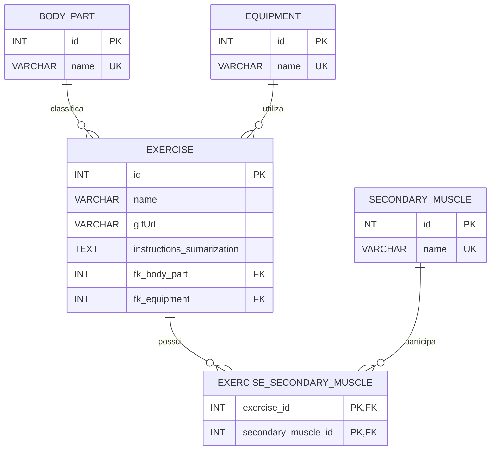

# etl-data-exercises

Pipeline de carregamento, tratamento, modelagem e ingestão de dados de exercícios físicos. O objetivo final é disponibilizar dados estruturados para uma aplicação de geração de treinos apoiada por LLM.

## Objetivo

O projeto transforma o arquivo CSV de exercícios em dados relacionais prontos para consulta:

- carrega e inspeciona os dados com Pandas;
- verifica duplicidades e valores disponíveis;
- consolida as instruções de cada exercício;
- separa equipamentos, partes do corpo e músculos secundários em tabelas de referência;
- cria a relação muitos-para-muitos entre exercícios e músculos secundários;
- cria as tabelas no MySQL e insere os dados respeitando as chaves estrangeiras;
- executa consultas para analisar os exercícios por parte do corpo, músculo e equipamento.

## Estado atual

O fluxo está sendo validado em um notebook, em [notebooks/tratamento_pandas_data.ipynb](notebooks/tratamento_pandas_data.ipynb). O notebook funciona como um protótipo executável para validar as regras de tratamento, o modelo relacional e as consultas.

Em uma próxima etapa, o fluxo será organizado em classes e módulos, separando responsabilidades como:

- leitura e validação dos dados;
- transformação e padronização;
- criação das entidades relacionais;
- conexão e persistência no banco;
- consultas para consumo da aplicação.

Essa separação permitirá testar cada parte isoladamente e reutilizar o pipeline fora do ambiente do notebook.

## Estrutura

```text
.
├── data/
│   └── exercises(1).csv
├── notebooks/
│   └── tratamento_pandas_data.ipynb
├── requirements.txt
└── README.md
```

## Pré-requisitos

- Python 3.10 ou superior;
- MySQL Server, caso queira executar a criação das tabelas, a carga e as consultas;
- VS Code com a extensão Jupyter ou Jupyter Notebook instalado;
- Git, caso o projeto seja clonado do repositório.

## Configuração do ambiente virtual

No PowerShell, a partir da pasta raiz do projeto:

```powershell
python -m venv .venv
.\.venv\Scripts\Activate.ps1
python -m pip install --upgrade pip
pip install -r requirements.txt
```

Se o PowerShell bloquear a ativação de scripts, execute uma vez, com o escopo do usuário:

```powershell
Set-ExecutionPolicy -ExecutionPolicy RemoteSigned -Scope CurrentUser
```

Depois, ative novamente o ambiente virtual.

## Bibliotecas utilizadas

As dependências estão em `requirements.txt`:

- `pandas`: leitura, limpeza e transformação dos dados;
- `SQLAlchemy`: criação da conexão e persistência dos DataFrames;
- `PyMySQL`: driver Python para conexão com o MySQL;
- `jupyter` e `ipykernel`: execução do notebook e seleção do ambiente no VS Code.

## Como abrir e executar o notebook

1. Abra a pasta do projeto no VS Code.
2. Selecione o interpretador `.venv` com `Python: Select Interpreter`.
3. Abra `notebooks/tratamento_pandas_data.ipynb`.
4. Selecione o kernel Python associado ao `.venv`.
5. Execute as células na ordem, começando pela importação e leitura do CSV.

### Atenção ao caminho do CSV

O notebook atualmente lê o arquivo usando apenas `exercises(1).csv`. Portanto, para executar o protótipo sem alterar o código, o diretório de trabalho da sessão precisa conter esse arquivo. Caso o CSV esteja apenas em `data/`, configure o diretório de trabalho do notebook para `data/` ou disponibilize uma cópia do arquivo no diretório usado pela sessão.

## Configuração do MySQL

Para executar a parte de banco:

1. Inicie o MySQL Server.
2. Crie o banco de dados que será usado pelo projeto.
3. Execute a célula de DDL do notebook para criar as tabelas.
4. Configure usuário, senha, host, porta e nome do banco na conexão.
5. Execute a função de inserção depois que as tabelas forem criadas.
6. Execute as consultas analíticas após a carga dos dados.

O fluxo de inserção segue esta ordem:

```text
body_part, equipment e secondary_muscle
					 ↓
				 exercise
					 ↓
	  exercise_secondary_muscle
```

## Diagrama final do banco

O banco será organizado com `exercise` como tabela principal. Partes do corpo e equipamentos possuem relação de um para muitos com exercícios. Músculos secundários se relacionam com exercícios por meio da tabela associativa `exercise_secondary_muscle`.



### Regras do relacionamento

- `body_part.id` é referenciada por `exercise.fk_body_part`.
- `equipment.id` é referenciada por `exercise.fk_equipment`.
- `exercise.id` e `secondary_muscle.id` formam a chave composta da tabela associativa.
- Um exercício pode possuir vários músculos secundários.
- Um músculo secundário pode aparecer em vários exercícios.
- A exclusão de um exercício ou músculo remove suas relações correspondentes na tabela associativa.

Não versionar senhas, tokens ou outras credenciais. Para o código definitivo, prefira variáveis de ambiente ou um gerenciador de segredos em vez de credenciais escritas no notebook.

## Execução por linha de comando

Com o ambiente virtual ativado, também é possível iniciar o Jupyter a partir da raiz do projeto:

```powershell
jupyter notebook
```

Depois, abra o notebook pela interface do Jupyter e selecione o kernel `.venv`.

## Próximos passos

- extrair o tratamento do notebook para classes e módulos Python;
- criar testes unitários para limpeza, modelagem e relacionamentos;
- centralizar a configuração do banco em variáveis de ambiente;
- corrigir o caminho do CSV para uma configuração independente do diretório de execução;
- automatizar a execução do ETL e a validação da carga;
- integrar os dados tratados à aplicação responsável pela geração de treinos.
